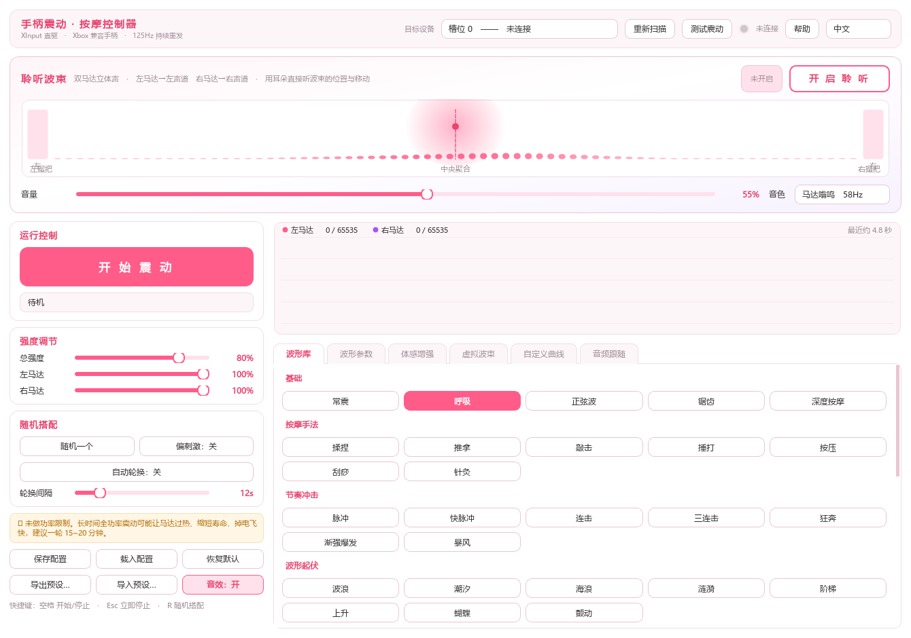
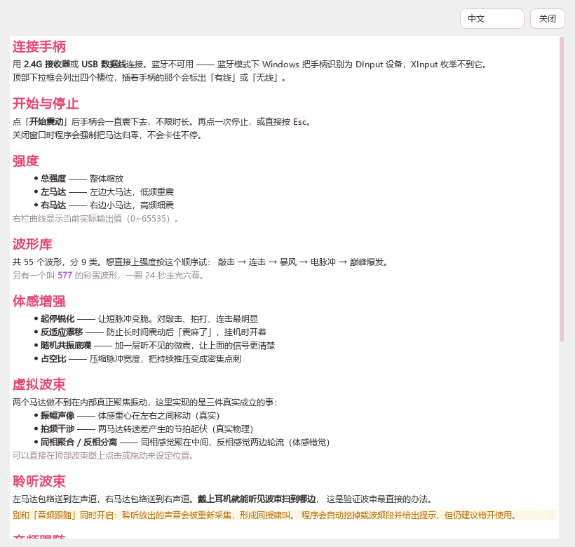
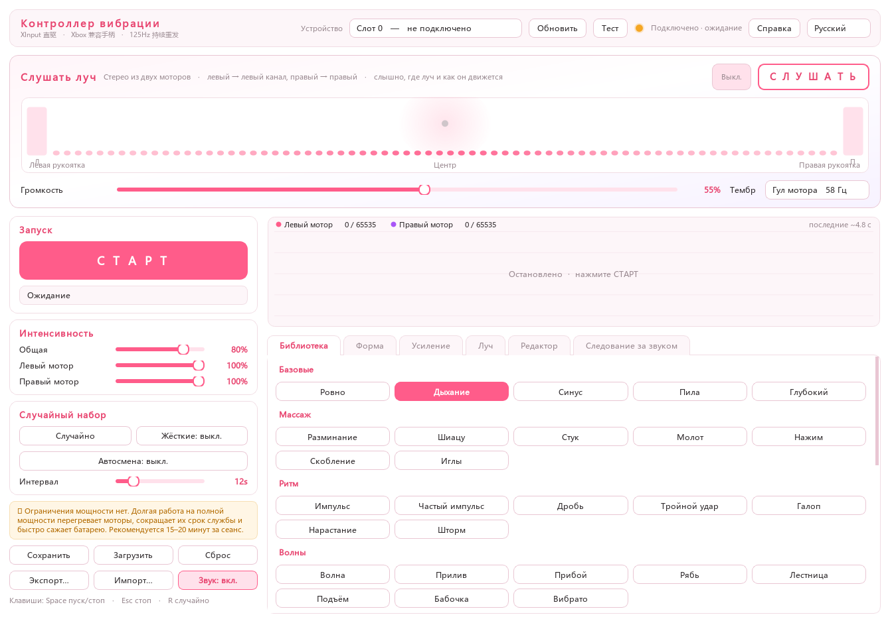
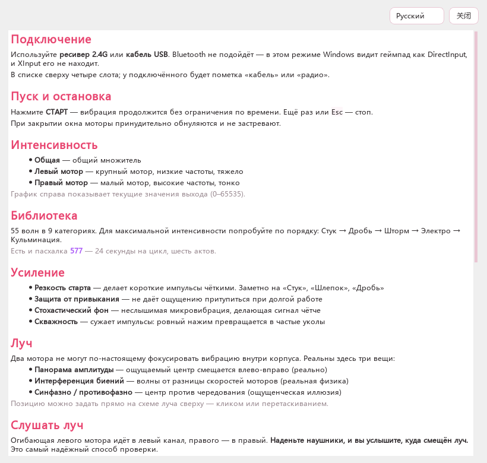

# 手柄震动按摩控制器

面向 **Xbox 协议手柄**（任何走 XInput 的手柄）的 Windows 桌面软件。
通过 XInput 直接驱动手柄的左右两个马达：持续震动、**59 种波形**（含玩具模式与节律引导）、
虚拟波束定位、音频跟随、四个有实验依据的体感增强，还能把波束渲染成立体声**用耳朵听**。

> 作者：**577**　·　界面支持 中文 / English / 日本語 / 한국어 / Русский，按 F1 或点「帮助」打开软件内的完整使用手册。
>
> 触觉玩法的调研报告见 **[RESEARCH.md](RESEARCH.md)** —— 里面写了硬件真相、
> 各种触觉错觉与增强手段的文献依据，以及还没做的玩法清单。

## 界面预览



<details>
<summary>更多截图（应用内使用手册 / 俄语界面）</summary>







</details>

---

## 一、先看这个：连接方式

| 连接方式 | 能用吗 | 说明 |
|---|---|---|
| **2.4G USB 接收器** | ✅ 推荐 | 走 XInput，延迟最低，震动最稳 |
| **USB 有线** | ✅ 推荐 | 走 XInput，最稳定，顺便充电 |
| 蓝牙 | ❌ 不可用 | 受微软限制，第三方手柄在蓝牙模式下拿不到 XInput。蓝牙连 PC 时手柄是 DInput 设备，XInput API 枚举不到它 |

> 所以请用 **2.4G 接收器**或**有线**连接。程序里显示的「槽位 0~3」就是 XInput 的四个插槽。

---

## 二、为什么它不会「震一会儿就停」

XInput 设置震动是一个**状态**，但手柄固件里普遍有**看门狗**——超过约 100ms 没收到新的震动指令，
固件就自动把马达归零。这就是各种小工具「震一会儿自己就停了」的根本原因。

本程序用一个独立线程以 **125Hz（每 8ms 一次）无条件重发**震动指令，所以：

- 点开始之后，它会一直震，不限时长
- 数值没变也会照发不误
- 手柄断连自动重试，重新插上立刻恢复震动

---

## 三、界面地图

```
┌─ 顶部：目标设备下拉框 / 重新扫描 / 测试震动 / 连接状态灯 ─────────────────┐
├─ 聆听波束（通栏，显眼位置）────────────────────────────────────────────┤
│   波束空间分布图 + 左右立体声电平表 + 开启聆听按钮 + 音量 + 音色          │
├──────────────┬─────────────────────────────────────────────────────────┤
│ 左栏          │ 实时输出曲线（左粉 / 右紫）                              │
│ ├ 运行控制    │ ┌─────────────────────────────────────────────────────┐ │
│ ├ 强度调节    │ │波形库│波形参数│体感增强│虚拟波束│自定义曲线│音频跟随│ │
│ ├ 随机搭配    │ └─────────────────────────────────────────────────────┘ │
│ └ 配置        │                                                         │
└──────────────┴─────────────────────────────────────────────────────────┘
```

---

## 四、虚拟波束（体感定位）

### 先说清楚物理边界

**两个偏心转子马达无法在内部真正聚焦振动。** 那需要多个激振器组成的相控阵列 + 精确相位控制；
手柄只有两个 ERM 马达，间距十几厘米、启停迟滞几十毫秒，物理上做不到"在一个点汇聚能量"。

本程序做的是三件**真实成立**的事：

| 效果 | 真实性 | 说明 |
|---|---|---|
| **振幅声像** | ✅ 真实 | 体感重心在左右握把之间移动。位置 -100% 全在左、0 中央、+100% 全在右 |
| **拍频干涉** | ✅ **真实物理** | 两个马达转速略有差异时，合成振幅按 `\|fL−fR\|` 的节拍周期性起伏。数学上 `cos(f₁)+cos(f₂) = 2cos((f₁+f₂)/2)·cos((f₁−f₂)/2)`，第二项就是拍频包络。1~6Hz 体感最明显 |
| **同相聚合 / 反相分离** | ⚠️ 体感错觉 | 同相时中枢把两路信号整合成「中间一个更强的振源」；反相时感知为「两边轮流」。是错觉，但确实好用 —— 这就是体感版的立体声定位原理 |

### 怎么用

- **位置**：拖滑杆，或者**直接在顶部波束图上点击/拖动**
- **聚焦度**：越大波束越锐利，一点点偏移就明显偏一边；越小越弥散
- **拍频**：0 关闭；1~6Hz 是甜区，会感受到一阵阵的涌动
- **自动扫掠**：波束自动左右来回扫，速度可调
- **极性**：同相 = 中央聚合，反相 = 两边轮流

---

## 五、聆听波束（用耳朵听）

手柄的两个马达天然就是一组立体声：

```
左马达的振动包络 ─→ 左声道
右马达的振动包络 ─→ 右声道
```

程序把这两路包络实时渲染成音频播放出来，**波束扫到哪边，声音就偏向哪边**。
这是唯一能立刻验证波束效果的手段 —— 不用贴着手柄猜。

- 4 种音色：马达嗡鸣（58Hz 正弦）· 超低潜行（36Hz）· 蜂鸣（168Hz 锯齿）· 颗粒摩擦（噪声）
- 音量可调，独立开关
- 面板上有左右电平表和波束空间分布可视化

> ⚠️ **别和「音频跟随」同时开**。聆听播放出来的声音会被 Loopback 重新采集，
> 若此时音源是「跟随音频」就形成自激回路。程序检测到这个组合会自动挖掉载波频段防回授，
> 并在面板上给出提示，但最干净的用法还是错开使用。

---

## 六、音频跟随

抓系统全局回放（WASAPI Loopback），任何软件在放声音都能跟。分频映射是按**马达物理特性**定的：

| 频段 | 驱动 | 为什么 |
|---|---|---|
| **20~120Hz 低频** | 左马达（大） | 大偏心质量擅长输出低频强震 |
| **120~4000Hz 中高频** | 右马达（小） | 小偏心质量擅长高频细震 |

三种模式：

- **只放波形** —— 纯波形震动
- **跟随音频** —— 音频能量直接驱动马达
- **波形 × 音频** —— 波形先被音频能量调制，相当于用音乐给按摩节奏打拍子

可调：采集灵敏度、触发阈值（滤底噪）、左右增益。

---

## 七、随机搭配

- **随机一个**（快捷键 `R`）：随机抽一套完整参数 —— 波形、混合波形、速度、强度下限、
  平滑、相位差、波束位置/聚焦度/扫掠/拍频/极性
  - 45% 概率做**双波形混合**，混出原库里没有的新节奏
- **偏刺激**：只在「刺激 / 极刺激」档位里抽
- **自动轮换**：每 N 秒换一套，**切换会自动对齐到波形循环的接缝处**，不会切一半

---

## 八、波形库（59 个，9 分类）

| 分类 | 波形 |
|---|---|
| **基础** | 常震 · 呼吸 · 正弦波 · 锯齿 · 深度按摩 |
| **按摩手法** | 揉捏 · 推拿 · 敲击 · 捶打 · 按压 · 刮痧 · 针灸 |
| **节奏冲击** | 脉冲 · 快脉冲 · 连击 · 三连击 · 狂奔 · 渐强爆发 · 暴风 |
| **波形起伏** | 波浪 · 潮汐 · 海浪 · 涟漪 · 阶梯 · 上升 · 蝴蝶 · 颤动 |
| **刺激** | 心跳 · 搏动 · 心动加速 · 电脉冲 · 抽搐 · 逗弄 · 巅峰爆发 |
| **玩具模式** | 烟花 · 地震 · 拍打 · 吸吮 · 抽送 · 摇头 · 蠕动 · 抖动 · 变频率 · 咕噜 |
| **节律引导** | 镇静节律 · 提神节律 · 4-7-8 呼吸 · 融化 · 失重 |
| **特殊** | 随机 · 混沌 · 摩斯码 · 递进 · 电火花 · 滴落 · 推力 · 频段切换 · 渐快 · 手绘曲线 |
| **彩蛋** | **577**（作者专属长叙事波形，一圈 24 秒走完六幕节奏） |

参数依据是按摩器械行业与震动玩具行业的公开规格：捶打冲击 10~60 次/秒、
揉捏 15~40 次/分、持续振动 3000~5000 次/分、间歇模式「震 3 秒停 2 秒」、
低频 8~12Hz 舒缓 / 高频 25Hz+ 强刺激。

想直接上强度：**敲击 → 连击 → 暴风 → 电脉冲 → 巅峰爆发**。
想玩玩具味：**烟花 → 地震 → 拍打 → 变频率**。

### 节律引导（有临床依据的一组）

**Doppel 效应**：*Scientific Reports* 2017 的单盲随机对照实验发现，
**慢于自身静息心率的、心跳般的节律刺激能显著降低生理唤醒与自评焦虑**。
研究还指出引导需要**渐进式**才有效。

- **镇静节律** —— 默认约 55 BPM，把「速度」滑杆调到 0.7x 约 38 BPM，效果更沉
- **提神节律** —— 默认约 109 BPM，速度 1.4x 约 150 BPM
- **4-7-8 呼吸** —— 吸气 4s → 屏息 7s → 呼气 8s。震起来吸气，最强时屏息，弱下去时呼气

### 手绘曲线

「自定义曲线」标签页里自己画「时间-强度」曲线：
左键空白加/拖点 · 右键或双击删点 · 滚轮在点上微调高度 · 首尾自动闭合无限循环。

---

## 九、体感增强（四个有实验依据的手段）

偏心转子马达（ERM）有三个物理短板：**频率和强度耦合在一个旋钮上、起停迟滞 15~30ms、
持续 2~5 秒后感知适应**。这一页的四个参数就是用来绕开它们的。

| 参数 | 解决什么 | 依据 |
|---|---|---|
| **起停锐化** | 短脉冲「发糊」。脉冲起始给 2 个 tick 满功率**过冲**冲过转子静摩擦，下降沿绕过平滑直接瞬切 | 微软在 Xbox 手柄里用的就是「电压冲击 + H 桥制动」 |
| **反适应漂移** | 挂久了「震麻了」。叠加一层极慢随机游走（相关时间 1.6s，满量程 ±10%） | 触觉适应在 2~5 秒内发生；10% 正好卡在振幅 JND（15%）之下，察觉不到但能打断适应 |
| **随机共振底噪** | 提升对细微变化的感知。叠加一层低于阈值的随机微震（上限 9% 幅度） | 随机共振现象，多篇论文在人体皮肤上重复验证过 |
| **占空比** | 改变脉冲宽窄，把「持续推压」变成「密集点刺」 | 触觉文献把占空比列为与频率、强度并列的独立情绪维度 |

默认值是「锐化 50% / 反适应 20% / 底噪 0 / 占空比 100%」，可以逐项开关对比。

**实测数据**（`selftest.py` 第 10 节）：60% 强度播「敲击」波形，关闭锐化峰值 0.108，
开启后 0.940；占空比 40% 让正弦波的静默占比从 0% 升到 42%。

---

## 十、点击动效与音效

- 按钮点击时从鼠标位置扩散一圈涟漪（340ms 缓出，裁切在圆角内）
- 8 种合成音效（点击 / 换波形 / 开关 / 随机 / 滑杆刻度 / 聆听开关）
  用 numpy 在启动时合成成 WAV 字节流，走 `winsound` 的内存播放 —— **零依赖、零磁盘文件**
- 左下角「音效：开/关」可以整体静音

---

## 十一、快捷键

| 按键 | 作用 |
|---|---|
| 空格 | 开始 / 停止 |
| Esc | 立即停止 |
| R | 随机搭配 |

关窗口时会强制把马达归零，不会出现马达卡着不停。同时会停止音频采集和播放。

---

## 十二、配置文件

配置存在 exe 同目录的 `presets.json`，退出时自动保存，下次打开自动恢复。
包含所有滑杆、波形、混合、波束、音频、体感增强参数以及自定义曲线。

- **保存配置 / 载入配置**：手动读写 `presets.json`
- **恢复默认**：回到出厂参数
- **导出预设… / 导入预设…**：存到任意 JSON，方便备份和分享

---

## 十三、从源码运行

```bash
pip install -r requirements.txt

python main.py                       # 启动
python selftest.py                   # 自检（不用手柄也能跑，含真实音频采集与干跑引擎测试）
QT_QPA_PLATFORM=offscreen python smoketest_ui.py   # 界面截图冒烟测试
```

引擎有一个 `dry_run` 开关：置 True 时不发 XInput 指令、假装设备已连接，
可以**在没有手柄的情况下预览波形、试听波束**，自动化测试也靠它。

打包后的 exe 也能自检，结果写到 exe 同目录的 `selftest_result.txt`：

```bash
VibrationController.exe --selftest
```

---

## 十四、打包

```bash
python build.py          # 单文件版（约 65MB）
python build.py --dir    # 文件夹版（启动更快，调试用）
```

或者双击 **`build.bat`**。产物在 `dist/` 下。

---

## 十五、注意

> ⚠ **本程序按你的要求没有做任何功率限制**，总强度可以拉到 100% 并长时间运行。
> 长时间全功率连续震动可能导致马达过热、明显缩短寿命，也会让手柄掉电很快。
> 建议单轮 15~20 分钟。

> ⚠ **不要和游戏同时用**。XInput 的震动是状态量、不排队，本程序每 8ms 覆盖一次，
> 会导致游戏里的震动失效。想玩游戏先把本程序停掉。

---

## 十六、文件说明

| 文件 | 作用 |
|---|---|
| `main.py` | 程序入口（含 `--selftest`） |
| `core/xinput_backend.py` | XInput 封装：设备枚举、连接检测、震动下发 |
| `core/rumble_engine.py` | 125Hz 震动引擎；波束/音源/体感增强合成 |
| `core/waveforms.py` | 59 个波形 + 曲线插值 + 随机搭配 |
| `core/beam.py` | 虚拟波束：声像、拍频干涉、极性 |
| `core/audio.py` | WASAPI Loopback 采集（FFT 分频）+ 立体声波束播放 |
| `core/sfx.py` | 界面音效合成与播放 |
| `core/timing.py` | 毫秒级计时精度（timeBeginPeriod） |
| `ui/main_window.py` | 主窗口 |
| `ui/beam_panel.py` | 聆听波束面板与空间可视化 |
| `ui/waveform_view.py` | 实时输出曲线 |
| `ui/curve_editor.py` | 手绘曲线编辑器 |
| `ui/widgets.py` | 涟漪动效按钮、滑杆等自定义控件 |
| `ui/theme.py` | 浅色 + 粉色主题样式表 |
| `ui/fonts.py` | 中文字体兜底 |
| `config.py` | 配置读写 |
| **`RESEARCH.md`** | **触觉玩法调研报告（硬件真相 / 文献依据 / 未做玩法）** |
| `selftest.py` | 核心自检（10 个板块） |
| `smoketest_ui.py` | 界面冒烟测试 |
| `make_icon.py` | 生成图标 |
| `build.py` / `build.bat` | 打包 |

---

## 十七、开源许可

本项目以 **GNU General Public License v3.0** 发布，全文见 [LICENSE](LICENSE)。

你可以自由使用、修改、分发本软件，包括商业用途；但**分发衍生作品时必须同样以 GPL-3.0 开源**，
并保留原作者署名。

### 第三方组件

| 组件 | 许可证 |
|---|---|
| [PySide6](https://www.qt.io/) / shiboken6 / Qt | LGPL-3.0 / GPL-2.0 / GPL-3.0（三选一） |
| [numpy](https://numpy.org/) | BSD-3-Clause 等一组宽松许可 |
| [PyAudioWPatch](https://github.com/s0d3s/PyAudioWPatch) | Apache-2.0 |
| [PyInstaller](https://pyinstaller.org/)（仅打包用） | GPL-2.0-or-later，附 bootloader 例外条款 |
| Pillow（仅图标生成脚本用） | MIT-CMU |

本项目未修改 PySide6 / Qt 源码，按 GPL-3.0 整体授权，与 Qt 的 LGPLv3 条款完全兼容。

### 免责声明

本项目为独立开发，与任何硬件厂商、外设品牌均无隶属、赞助或授权关系。
波形名称中的行业术语（如持续、间歇、渐强、海浪、脉冲等）为按摩器械与震动设备的通用描述词。

### 安全提示

> ⚠ 本软件**没有做功率限制**，总强度可以拉到 100% 并长时间运行。
> 长时间全功率连续震动可能导致马达过热、缩短寿命、手柄掉电加快。建议单轮 15~20 分钟。
>
> ⚠ 手柄震动属物理刺激，如有心血管疾病、皮肤损伤、感觉障碍或处于孕期，请先咨询医生。
> 请勿在驾驶、操作机械或需要保持注意力的场合使用。

---

作者：**577**
